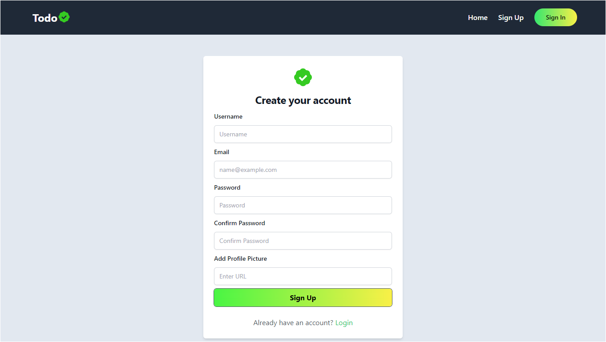
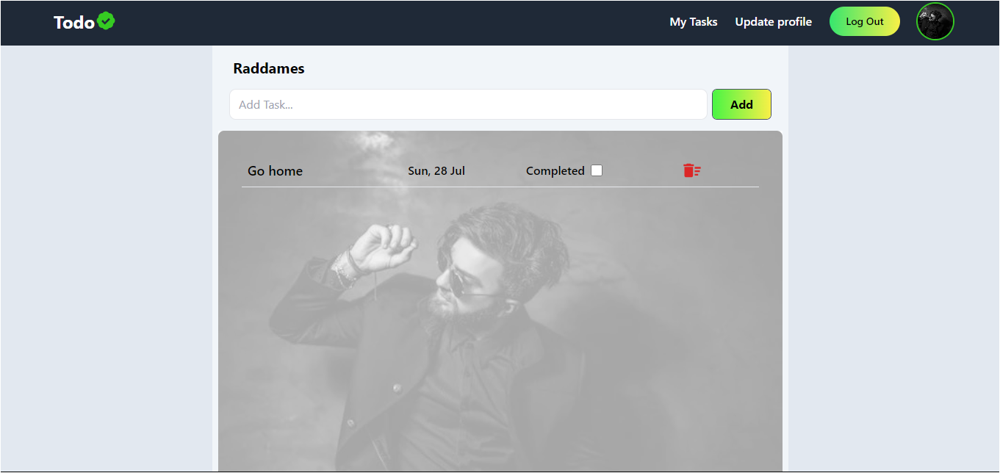
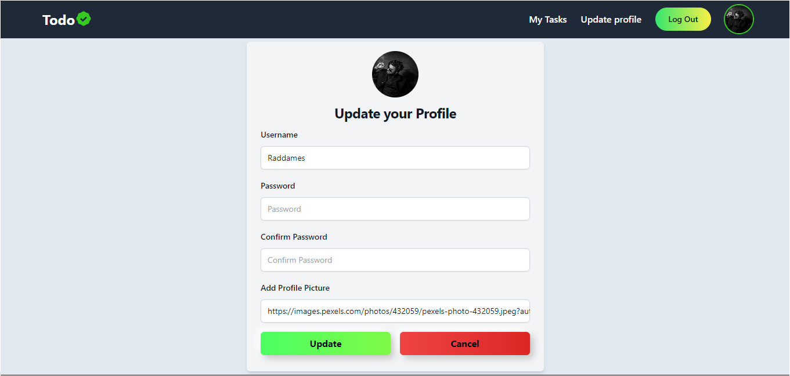

# To-Do App

Welcome to the To-Do App! This application is designed to help you manage your tasks efficiently. Built with React, Vite, Tailwind CSS, and Python (Flask), the app offers a seamless user experience and powerful backend functionality. The app is deployed using Render and Netlify for a reliable and scalable deployment.

## Features

- **Task Management**: Create, update, and delete tasks easily.
- **User Authentication**: Secure user registration and login.
- **Responsive Design**: A mobile-friendly interface built with Tailwind CSS.
- **Real-time Updates**: Tasks update in real-time without needing a page refresh.
- **Deployed on Render and Netlify**: Reliable and scalable deployment for both the frontend and backend.

### Overview Images
Sign in Page

Sign up Page

Task Manager

Update Profile


## Tech Stack

### Frontend

- **React**: A JavaScript library for building user interfaces.
- **Vite**: A build tool that provides a faster and leaner development experience for modern web projects.
- **Tailwind CSS**: A utility-first CSS framework for rapidly building custom user interfaces.

### Backend

- **Python**: A versatile programming language.
- **Flask**: A lightweight WSGI web application framework in Python.

### Deployment

- **Netlify**: Deployment platform for the frontend.
[](https://app.netlify.com/sites/todoappstarter/deploys)
- **Render**: Deployment platform for the backend.

## Getting Started

### Prerequisites

- Node.js and npm installed
- Python and pip installed

### Installation

1. **Clone the repository**:

   ```bash
   git clone git@github.com:Raddames-Tonui/TodoApp.git
   cd TodoApp

2. **Install frontend dependencies:**

   ```bash
    cd frontend
    npm install

3. **Install backend dependencies:**

   ```bash
    cd backend
    pip install -r requirements.txt

## Contributing
Contributions are welcome! Please fork the repository and create a pull request with your changes.