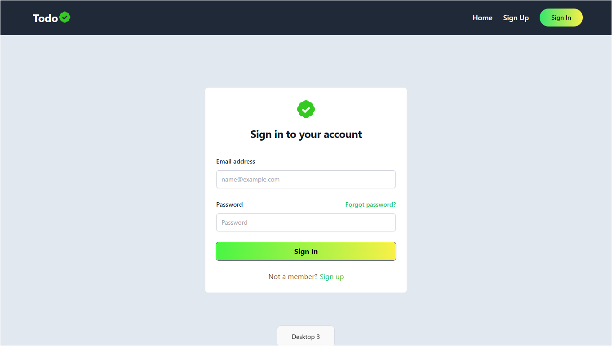
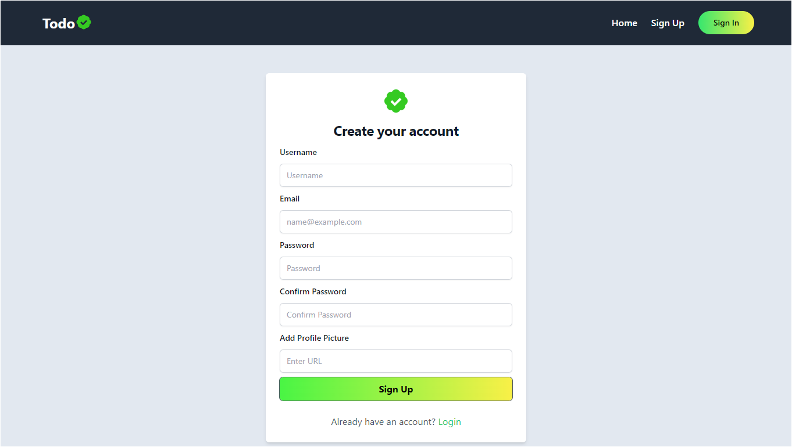
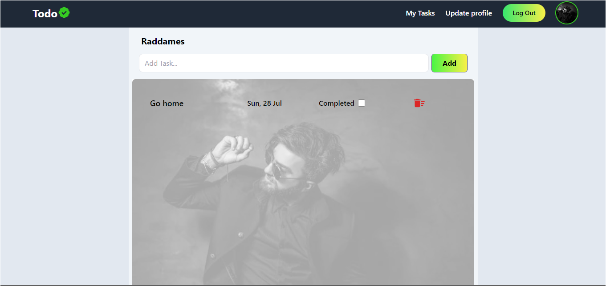
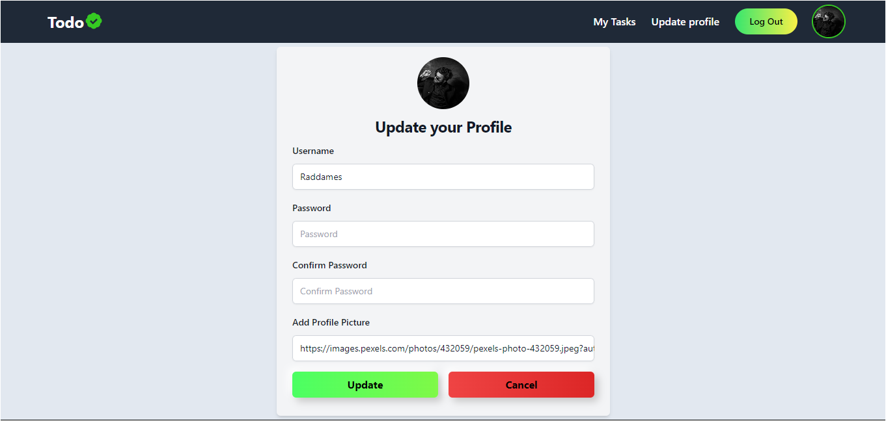

# **To-Do App**  

Welcome to the To-Do App! This application helps you manage tasks efficiently. Built with React, Vite, Tailwind CSS, and Python (Flask), it offers a seamless user experience and a powerful backend. The app is deployed using Render and Netlify.

## **Table of Contents**
1. [General Setup](#general-setup)
2. [Deploying with Render](#deploying-with-render)
3. [Docker Setup](#docker-setup)
4. [Environment Variables](#environment-variables)
5. [Features](#features)
6. [Tech Stack](#tech-stack)
7. [Getting Started](#getting-started)
8. [Contributing](#contributing)
9. [License](#license)

---

## **General Setup**  
Instructions for running the project locally without Docker or Render.

```sh
git clone https://github.com/Raddames-Tonui/TodoApp.git
cd TodoApp
```

### **Frontend Setup**
```sh
cd frontend
npm install  # Install dependencies
npm run dev  # Start development server
```

### **Backend Setup**
```sh
cd backend
pip install -r requirements.txt  # Install dependencies
flask run  # Start Flask server
```

---

## **Deploying with Render**  
Steps for deploying the backend on [Render](https://render.com/).

1. Sign in to Render.
2. Create a new **Web Service**.
3. Connect your GitHub repository.
4. Set the environment variables as shown in [Environment Variables](#environment-variables).
5. Click **Deploy**.

---

## **Docker Setup**  
Run the project using Docker.

1. **Build and run the container**:
   ```sh
   docker-compose up -d
   ```

2. **Stopping and removing containers**:
   ```sh
   docker-compose down --volumes
   ```

3. **Rebuilding the container**:
   ```sh
   docker-compose up --build
   ```

---

## **Environment Variables**  
List of required environment variables. Example:

```env
DB_HOST=your-db-host
DB_PORT=5432
SECRET_KEY=your-secret-key
```

Provide an `.env.example` file for reference.

---

## **Features**

- **Task Management**: Create, update, and delete tasks.
- **User Authentication**: Secure user registration and login.
- **Responsive Design**: Mobile-friendly interface using Tailwind CSS.
- **Real-time Updates**: Tasks update in real-time without refreshing.
- **Deployed on Render and Netlify**: Reliable and scalable deployment.

### **Overview Images**
Sign in Page  
  
Sign up Page  
  
Task Manager  
  
Update Profile  
  

---

## **Tech Stack**

### **Frontend**
- **React**: JavaScript library for building UIs.
- **Vite**: Fast and lean development tool.
- **Tailwind CSS**: Utility-first CSS framework.

### **Backend**
- **Python**: Versatile programming language.
- **Flask**: Lightweight web framework for Python.

### **Deployment**
- **Netlify**: Deployment for the frontend.  
  [](https://app.netlify.com/sites/todoappstarter/deploys)
- **Render**: Deployment for the backend.

---

## **Getting Started**

### **Prerequisites**
- Node.js and npm installed
- Python and pip installed

### **Installation**
1. **Clone the repository**:
   ```sh
   git clone git@github.com:Raddames-Tonui/TodoApp.git
   cd TodoApp
   ```
2. **Install frontend dependencies**:
   ```sh
   cd frontend
   npm install
   npm run dev
   ```
3. **Install backend dependencies**:
   ```sh
   cd backend
   pip install -r requirements.txt
   ```

---

## **Contributing**  
Contributions are welcome! Please fork the repository and create a pull request with your changes.

---

## **License**  
Specify the license (e.g., MIT, Apache 2.0).

